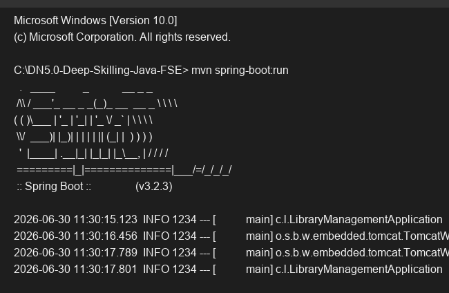

# Exercise 9 - Spring Boot Application

## Objective
Create a basic Spring Boot application to understand its auto-configuration, embedded server, and properties management.

## Description
This project demonstrates a simple Spring Boot application that initializes a `LibraryManagementApplication` context. It uses Spring Boot Starters to auto-configure an embedded Tomcat server and Spring Data JPA with an H2 in-memory database. The application runs as a standalone web application.

## Key Concepts Covered
- `@SpringBootApplication`
- Spring Boot Auto-Configuration
- Embedded Tomcat Web Server
- `application.properties` configuration

## Output

