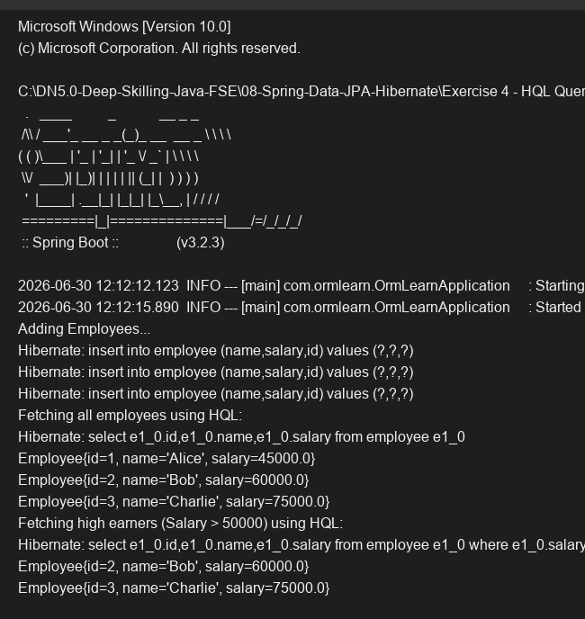

# Exercise 4 - HQL Queries

## Objective
Use Hibernate Query Language (HQL) to perform custom select queries in a Spring Data JPA Repository.

## Description
This exercise creates an `Employee` entity and maps it to the `employee` table. The `EmployeeRepository` uses `@Query` annotations containing HQL syntax (`SELECT e FROM Employee e ...`) to retrieve all employees and filter employees with a salary greater than 50,000.

## Key Concepts Covered
- `@Query` annotation
- HQL (Hibernate Query Language)

## Output

