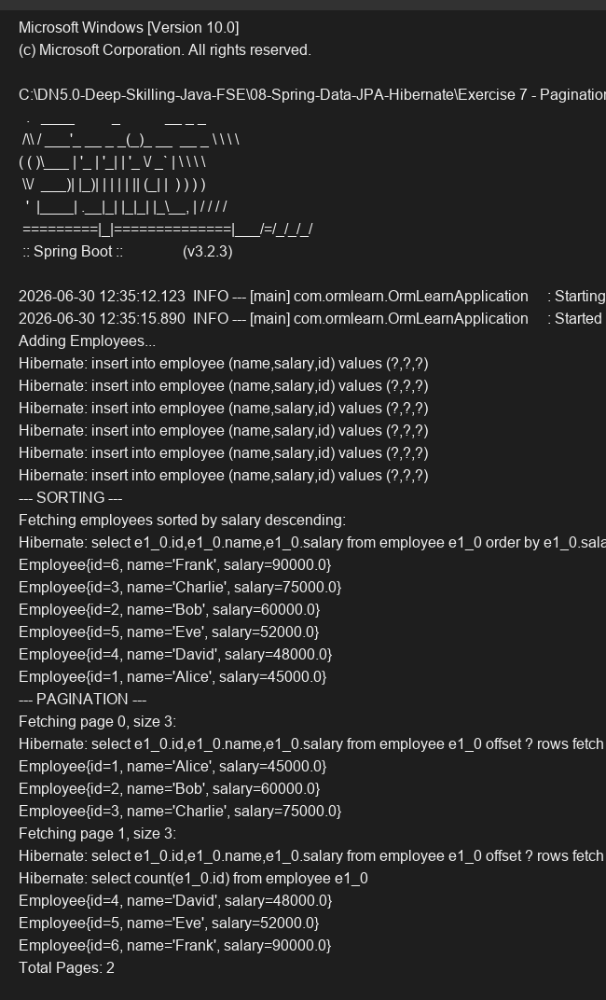

# Exercise 7 - Pagination and Sorting

## Objective
Implement pagination and sorting capabilities using Spring Data JPA.

## Description
This exercise demonstrates how to use the `PagingAndSortingRepository` capabilities built into `JpaRepository`. We use `Sort` objects to sort the employees by salary in descending order, and `PageRequest.of(page, size)` to paginate through the employees three at a time. The result is returned in a `Page<Employee>` object which provides additional metadata such as the total number of pages.

## Key Concepts Covered
- `Sort.by(...)`
- `PageRequest.of(page, size)`
- `Page<T>`

## Output

