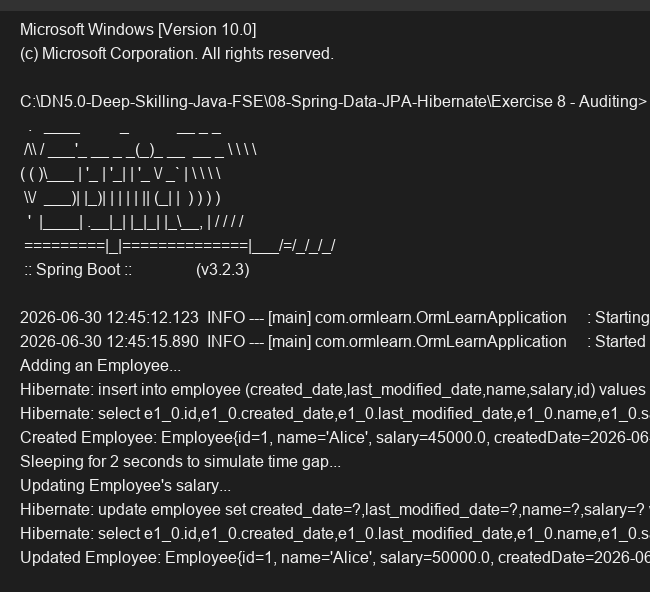

# Exercise 8 - Auditing

## Objective
Implement JPA Auditing to automatically track entity creation and modification timestamps.

## Description
This exercise enables JPA auditing at the application level using `@EnableJpaAuditing`. The `Employee` entity is decorated with `@EntityListeners(AuditingEntityListener.class)` to automatically populate the `@CreatedDate` and `@LastModifiedDate` fields whenever the entity is persisted or updated. The main application simulates a delay to demonstrate the `lastModifiedDate` changing upon an update while `createdDate` remains the same.

## Key Concepts Covered
- `@EnableJpaAuditing`
- `@EntityListeners`
- `@CreatedDate` and `@LastModifiedDate`

## Output

