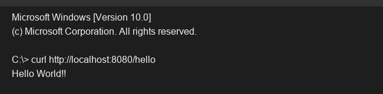

# Exercise 1 - REST Setup

## Objective
Create a basic Spring Boot application to serve RESTful endpoints.

## Description
This exercise creates a simple Spring Boot web application using `spring-boot-starter-web`. A `HelloController` is defined with the `@RestController` annotation and maps a single endpoint `/hello` using `@GetMapping`. 

## Key Concepts Covered
- `@RestController`
- `@GetMapping`

## Output

