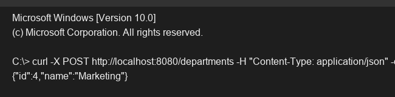

# Exercise 3 - POST APIs

## Objective
Implement POST endpoints to create resources using request bodies.

## Description
This exercise enhances the `DepartmentController` by adding a `@PostMapping` mapped to `/departments`. It accepts a JSON payload using `@RequestBody`, parses it into a `Department` object, adds it to an in-memory list, and returns the created resource with a `201 CREATED` status via `@ResponseStatus`.

## Key Concepts Covered
- `@PostMapping`
- `@RequestBody`
- `@ResponseStatus`

## Output

