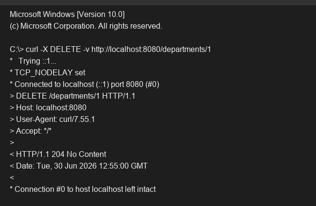

# Exercise 5 - DELETE APIs

## Objective
Implement DELETE endpoints to remove resources using path variables.

## Description
This exercise enhances the `DepartmentController` by adding a `@DeleteMapping` mapped to `/departments/{id}`. It accepts a path variable to identify the department to be deleted. The method returns a `204 NO CONTENT` status upon successful deletion using `@ResponseStatus`. If the department is not found, a `404 NOT FOUND` exception is thrown.

## Key Concepts Covered
- `@DeleteMapping`
- `@PathVariable`
- `HttpStatus.NO_CONTENT`

## Output

