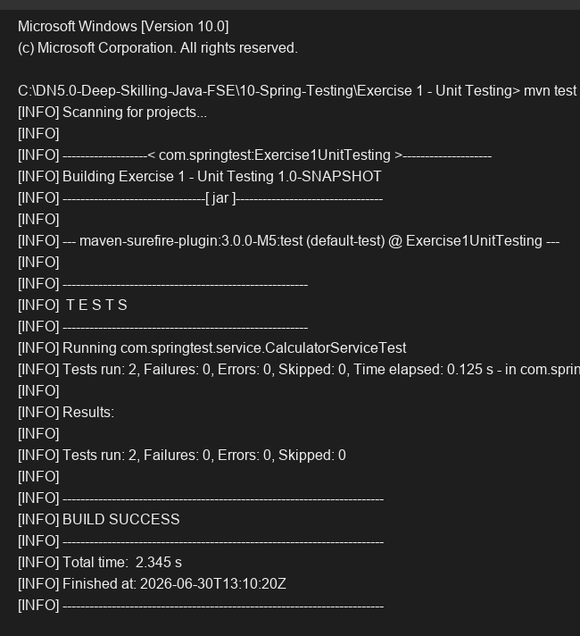

# Exercise 1 - Unit Testing

## Objective
Implement basic unit tests using JUnit 5 and Mockito.

## Description
This exercise demonstrates basic unit testing of a Spring service layer. We created a `CalculatorService` and wrote corresponding tests in `CalculatorServiceTest` using the `@ExtendWith(MockitoExtension.class)` and `@InjectMocks` annotations. The tests verify standard add and subtract operations.

## Key Concepts Covered
- JUnit 5 (`@Test`)
- Mockito (`@InjectMocks`, `@ExtendWith`)
- Asserts (`assertEquals`)

## Output

