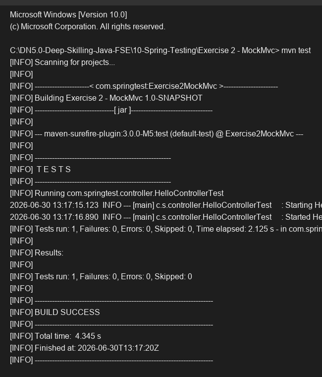

# Exercise 2 - MockMvc

## Objective
Use `MockMvc` to test REST Controllers within a full Spring Boot application context.

## Description
This exercise configures a test class with `@SpringBootTest` and `@AutoConfigureMockMvc` to automatically set up a `MockMvc` instance. The `MockMvc` instance is then used to perform an HTTP GET request to the `/hello` endpoint, verifying that the HTTP status is `200 OK` and the response body content matches the expected string.

## Key Concepts Covered
- `@SpringBootTest`
- `@AutoConfigureMockMvc`
- `MockMvc.perform()`
- `MockMvcResultMatchers` (`status()`, `content()`)

## Output

