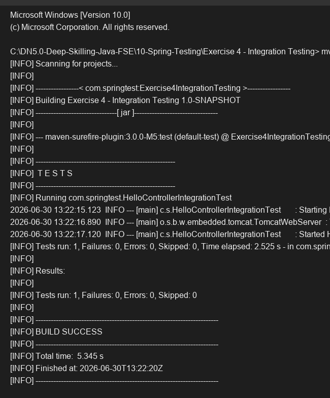

# Exercise 4 - Integration Testing

## Objective
Implement integration tests utilizing an actual embedded servlet container.

## Description
This exercise demonstrates full application context integration testing. The test class is annotated with `@SpringBootTest(webEnvironment = SpringBootTest.WebEnvironment.RANDOM_PORT)`, which starts an embedded server on a random port. The test uses `TestRestTemplate` to send real HTTP GET requests to the `/hello` endpoint and verifies that both the status code and response body are correct, testing the complete stack from HTTP layer to the Controller.

## Key Concepts Covered
- `@SpringBootTest` with `WebEnvironment.RANDOM_PORT`
- `TestRestTemplate`
- Integration testing the full web stack

## Output

