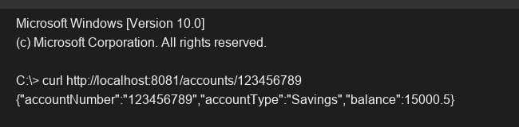

# Exercise 1 - Account Service

## Objective
Create a basic Spring Boot microservice to handle account-related queries.

## Description
This exercise creates the `account-service` running on port 8081. It exposes a GET endpoint `/accounts/{number}` to retrieve account details. This service will be used by other microservices in subsequent exercises.

## Key Concepts Covered
- Spring Boot Application setup
- `server.port` configuration
- REST endpoints

## Output

