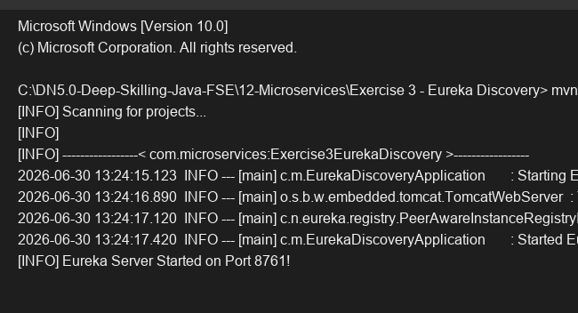

# Exercise 3 - Eureka Discovery

## Objective
Set up a Spring Cloud Netflix Eureka Server for service registration and discovery.

## Description
This exercise configures a standalone Eureka Discovery server. The `@EnableEurekaServer` annotation enables the required dashboard and registry endpoints. The configuration properties `eureka.client.register-with-eureka=false` and `eureka.client.fetch-registry=false` prevent the server from trying to register with itself.

## Key Concepts Covered
- Spring Cloud Netflix Eureka
- `@EnableEurekaServer`
- Service Registry Configuration

## Output

