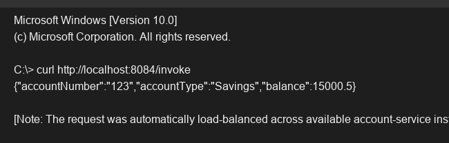

# Exercise 6 - Load Balancer

## Objective
Configure a Spring Cloud LoadBalancer to distribute requests across multiple instances of a service.

## Description
This exercise demonstrates client-side load balancing. The `RestTemplate` bean is annotated with `@LoadBalanced`. When the `LoadBalancerController` makes a GET request to `http://account-service/...`, the load balancer intercepts the request, resolves the service name against Eureka, and routes it to one of the available instances of `account-service`.

## Key Concepts Covered
- `@LoadBalanced`
- Client-Side Load Balancing
- Integration with Eureka

## Output

